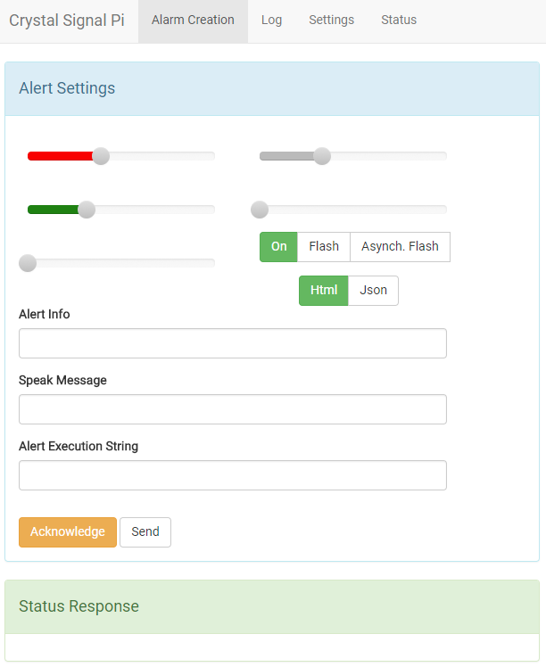
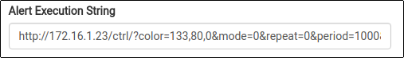
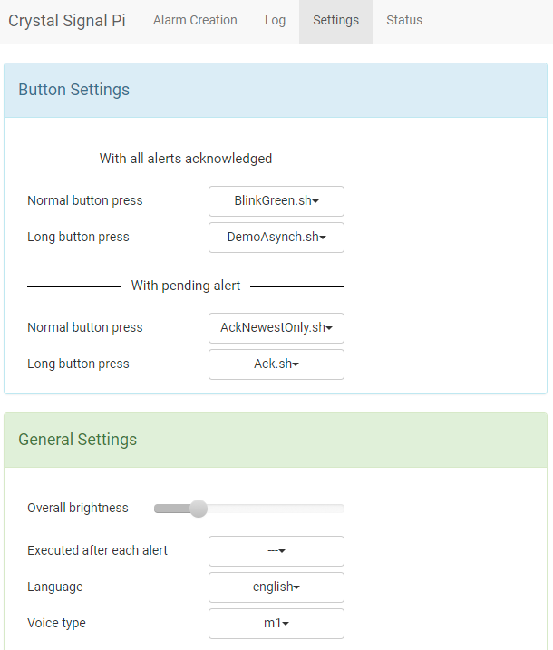
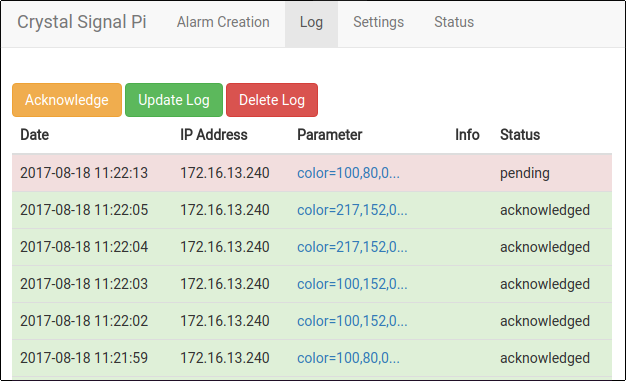

## What is this?

This repository contains the middleware needed to run the Crystal Signal Pi hardware, which allows you to turn your Raspberry Pi into a notifier device. 

## What you need

* The Crystal Signal Pi HAT (Hardware Attached on Top) 
* A Raspberry Pi 1, 2 or 3 Model B
* A micro SD card 
* A micro USB cable 

## Installing the middleware 

### Get Raspbian

Your Raspberry Pi needs to run an operating system in order to run the Crystal Signal Pi middleware. 
You can skip this step if you already have one in place. 

Download [Raspbian](https://www.raspberrypi.org/downloads/raspbian/) and install it to the micro SD card following [these instructions](https://www.raspberrypi.org/documentation/installation/installing-images/README.md).
*(The Crystal Signal Pi middleware is successfully tested with 2016-09-23-raspbian-jessie-lite and 2017-08-16-raspbian-stretch-lite)*

### Get the Crystal Signal Pi middleware

So how do you get the middleware on your Raspberry Pi? Just log in to your Raspberry Pi and execute the following commands. Note that you will need root user permissions to get these steps done. 

```
$ curl -O https://raw.githubusercontent.com/infiniteloop-inc/crystal-signal/master/install.sh
$ sudo bash install.sh
```

The first line gets the installer script file. This script contains all the instructions for the installation process. 
With the second command we execute the script, resulting in the installation of the Crystal Signal Pi middleware. 

There is also the option to run a "fullinstall". This is a convenient option if you just want to use the Crystal Signal Pi without having to worry about anything at all.
This will update your Raspbian OS and set the timezone (to the Asia/Tokio timezone. Which is probably not what you want. We need to change this). 

*Note that updating the OS takes quite a lot of time. In Some cases you will need to restart your Raspberry Pi after installation has finished.*

```
$ sudo bash install.sh fullinstall
```

### Updating the Crystal Signal Pi

We are still adding new features to the Crystal Signal Pi middleware. 
If you want to update to a newer version, just run these commands on your Raspberry Pi.

```
$ curl -O https://raw.githubusercontent.com/infiniteloop-inc/crystal-signal/master/install.sh
$ sudo bash install.sh update
```

## How to use 

### Using the Web UI

Typing http://<Your Raspberry Pi's IP address>/ will bring up the Web UI (it should look like the image below).
Here you can set up an alert / blinking pattern and copy the resulting "Alert Execution String" to get the same alert upon using the string as a URL.

* Moving the sliders should result in different colored light coming from the Crystal Signal Pi.
* The 3 buttons "On / Flash / Asynch. Flash" allow you to set the mode of the alert.
    * Asynchronous Flash mode is a mode where the red, green and blue colors blink at different speeds.
* Use the Alert Info field to convey details about the alert. 
* You can choose whether the Crystal Signal Pi responds to an alert by sending back a HTML or Json message.
* Acknowledge all pending alerts by pressing the "Acknowledge" button.
* You can resend an alert with the current settings by clicking the "Send" Button. 
* Click on the "Log" tab to get an overview of all issued alerts. Starting with the newest on the top.
* On the "Settings" tab you will find General Settings as well as the setup of the Crystal Signal Pi's Button Scripts (more on that later).  
* The "Status" tab will show you what kind of alert is currently pending.



### Using the API

Whatever you achieve with the Web UI can also be achieved through the API. The API is important because it is key in enabling other devices on the same network to issue alerts.


| Parameter | use |
|-----|-----|
| color | Contains the color values (R, G, B, with a range from 0 to 255) for the LED |
| mode | 0: On 1: Flash 2 : Asynchronous Flash. defaults to 0. |
| period | If mode=1 this parameter sets the length of the flashing interval in milliseconds. defaults to 1000ms (1 sec) |
| repeat | If mode=1 this parameter sets the number of repeats. Defaults to 0, which means that it'll flash forever. |
| ack | Used to Acknowledge alerts. If ack=1 all pending alerts will be acknowledged. The newest Acknowledged alert can be brought back using ack=0 |
| json | If json=1 the current status will be returned in JSON format. This comes in handy when using the returned status data in a shell script. |
| noscript | If noscript=1 the script setup to run whenever an alert was issued will not be executed. |
| info | This parameter can be used to add some detailed information about the alert (will show up in the log).|

Here is a small example of how to issue an alarm from another computer on the same network using [cURL](https://en.wikipedia.org/wiki/CURL). 

```
$ curl 'http://172.16.1.10/ctrl/?color=10,200,30&mode=1&repeat=0&period=500'
```

Note how issuing alerts from other computers on the same network is as simple as copying a URL. As soon as the URL gets accessed, the alert inscribed in it will get executed.
When creating a new alert on the Alarm Creation tab of the Web UI, it's URL will show up in the "Alert Execution String" Field. Just copy and execute the URL from anywhere on the network to issue an alert on the Crystal Signal Pi.



### Custom Script Execution on Alert / Button Press

The Crystal Signal Pi allows you to execute custom scripts (shell scripts) on alert execution / button press. The button mentioned here is the one placed on the Crystal Signal Pi PCB.
In the default setup, the button acts as a acknowledge-all-alerts button when pressed while a alarm is pending. This script is named "Ack.sh" and can be found here: /var/lib/crystal-signal/scripts.



You can assign your own scripts to the Crystal Signal Pi by simply dropping them into the /var/lib/crystal-signal/scripts directory.
After adding a script, it will show up as an entry in the drop down menu of the Settings tab (you may need to reload the page). 

Here's a small example. By adding the script shown below to /var/lib/crystal-signal/scripts/shutdown.sh, setting it up to be executable (e.g. sudo chmod + x <scriptname>) and assigning it to "Long button press" in the "With all alerts acknowledged" section on the Settings tab, we can get the Raspberry Pi to shutdown when there's no pending alert and the button gets pressed longer then 2 seconds. 

```
#!/bin/sh

poweroff
```
**Note: Scripts need to be setup to be executable.**

**Note: The sample scripts that come with this middleware will get overwritten with every update. If you want to customize one of the sample scripts copy its contents into a new script file first.**

**Note: Be careful when setting up a scripts to the "Executed after each alert" option. While issuing a new alarm from within a script is fine for button scripts, asigning such a script to "Executed after each alert" will lead to alerts rucursively creating new alerts, which probably isn't what you want.**

## Using the log 

Crystal Signal Pi comes with a log containing up to 500 alert messages with the newest alert on the top.
It can be accessed via the Web UI under the "Log" tab.

Each log message contains information about 

* The date when the alert was issued
* The IP address of the computer from which the alert was issued
* The parameter values which were being sent
* The info message 
* Whether or not the alarm was acknowledged or still is pending




The log gets cleared on restart.

## License

### Crystal Signal Pi Middleware

This work is licensed under the [BSD 3-Clause License](https://opensource.org/licenses/BSD-3-Clause).

Copyright (c) 2016-2017  Infiniteloop Co.,Ltd

### HTS Voice "Mei"

This work is licensed under the [Creative Commons Attribution 3.0 license](https://creativecommons.org/licenses/by/3.0/legalcode).

Copyright (c) 2009-2015  Nagoya Institute of Technology
                         Department of Computer Science
