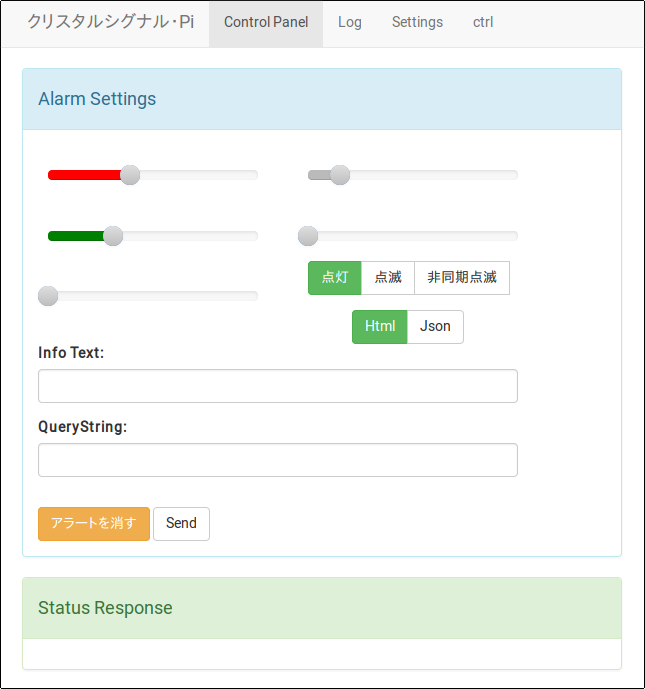
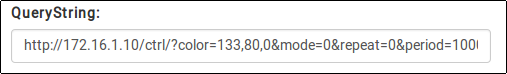
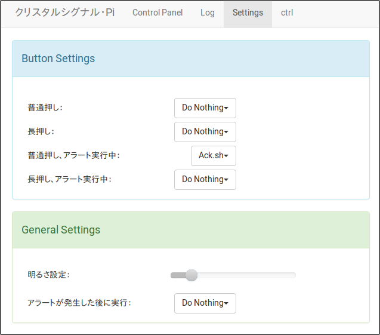
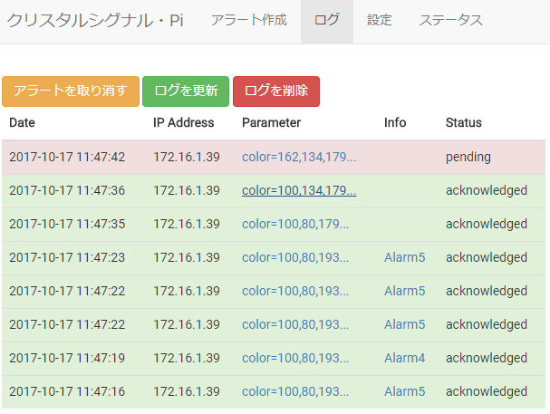

## このリポジトリは何？

[株式会社インフィニットループ](https://www.infiniteloop.co.jp/)が販売する[Crystal Signal Pi](http://crystal-signal.com/)を動作させるための、ミドルウェア一式です。

ここではミドルウェアの機能と操作方法を説明します。

## 用意するもの

* Crystal Signal Pi本体
* Raspberry Pi 第一世代Model B+以降
* microSDカード
* microUSBケーブル

## インストール方法

### Raspbianのインストール

microSDカードに[Raspbian](https://www.raspberrypi.org/downloads/raspbian/)をインストールしてください。インストール方法は[公式のドキュメント](https://www.raspberrypi.org/documentation/installation/installing-images/README.md)を参照してください。

*(2016-09-23-raspbian-jessie-liteにおいて動作を確認しています)*

### Crystal Signal Piミドルウェアのインストール

Raspberry Pi上で以下のコマンドを実行してください。インストールにはroot権限が必要になります。

*(2016/12/14 追記) 従来はOSのアップデートを同時に行っていましたが、初回インストールに時間がかかりすぎるため、デフォルトの動作を変更しました。従来通りOSアップデートとインストールを同時に行いたい場合は、下記のfullinstallを利用してください。*

```
$ curl -O https://raw.githubusercontent.com/infiniteloop-inc/crystal-signal/master/install.sh
$ sudo bash install.sh
```

以下のように`fullinstall`を指定すると、OSのアップデートとタイムゾーンの変更(Asia/Tokyo)を行った上でミドルウェアをインストールします。Raspbianの設定を自分でいじりたくない、何も考えずにCrystal Signal Piをすぐに動かせる状態にしたい、という方向けのコマンドです。

*OSのアップデートは完了までには少々時間がかかります。また完了後、Raspberry Piの再起動が必要な場合があります。*

```
$ sudo bash install.sh fullinstall
```

### Crystal Signal Piミドルウェアのアップデート

より新しいミドルウェアがリリースされた場合は、Raspberry Pi上で以下のコマンドを実行してください。ミドルウェアのみが最新にアップデートされます。

```
$ curl -O https://raw.githubusercontent.com/infiniteloop-inc/crystal-signal/master/install.sh
$ sudo bash install.sh update
```

## Crystal Signal Piの使い方

### Web UIからの操作方法

Webブラウザーから http://(Raspberry PiのIPアドレス)/ にアクセスすると、以下のWeb UI画面が表示されます。

* スライダーを動かすことで、LEDの色(RGB値)と点滅速度を調整できます。
* 点灯/点滅/非同期点滅をボタンで切り替えられます。
    * 非同期点滅とは、RGBそれぞれの色を異なる周期で点滅させる機能です。点滅しながら色が変化します。
* info Textには任意のメッセージを記述できます。
* アプリケーションのレスポンス表示を、HTMLとJSONで選択できます。
* 「アラートを消す」ボタンをクリックすると、LEDが消灯します。
* 「Send」ボタンをクリックすると、現在の設定値でアラートを再送します。
* 「Log」ページでは、直近に発生したアラートの一覧を閲覧できます。
* 「Settings」ページでは、LEDの輝度と、ボタン押下時、アラート発生時に実行するスクリプトを設定できます(後述)。
* 「ctrl」ページでは、現在のCrystal Signal Piの状態(設定されているパラメータ)を確認できます。



### APIからの操作方法

Crystal Signal Piは、curlコマンド等からAPIを直接叩くことで、Web UIからの操作と同等の制御ができます。

| パラメータ | 用途 |
|-----|-----|
| color | LEDのRGB値を、それぞれ0から255の範囲で指定します。 |
| mode | LEDの点灯/点滅を指定します。0で点灯、1で点滅、2で非同期点滅となり、デフォルト値は0です。 |
| period | mode=1が指定された時の、点滅のインターバルをミリ秒で指定します。デフォルト値は1000(1秒)です。 |
| repeat | mode=1が指定された時の、点滅回数を指定します。デフォルト値は0(無限)です。 |
| ack | アラートの発生、停止を指定します。デフォルト値は0で、アラートが発生(LEDが点灯)します。ack=1を指定すると、その他のパラメータにかかわらず、LEDが消灯します。 |
| json | json=1を指定すると、現在のCrystal Signal Piの状態をJSONフォーマットで返します。この際、他のパラメータはすべて無視されます。シェルスクリプト等から副作用なしに、現在の状態を取得するためのパラメータです。 |
| noscript | 1を指定すると、アラート発生時に設定されているスクリプトを実行しません。(ベータ版) |
| info | 任意のメッセージを記述できます。 |

(curlからLEDを点滅させる例)
```
$ curl 'http://172.16.1.10/ctrl/?color=10,200,30&mode=1&repeat=0&period=500'
```
Web UIのQueryStringの欄には、現在のスライダーの状態をAPI経由で再現するためのURLとクエリ文字列が表示されています。スライダーを動かしてリアルタイムに動作を確認しながら、直感的にクエリ文字列を作ることができます。



### ボタン押下時/アラート発生時の設定

Crystal Signal Piでは、ボタン押下時とアラートの発生時に任意のスクリプトを実行させることができます。デフォルトではアラート発生中にボタンを押した時に、アラートを停止(LEDを消灯)するスクリプト(Ack.sh)が登録されています。



独自のスクリプトを利用したい場合は、/var/lib/crystal-signal/scriptsディレクトリ内にスクリプトをインストールしてください。Settingsページをリロードすると、プルダウンメニューにディレクトリ内のスクリプトが列挙されます。各機能にアサインしたいスクリプトを選択してください。

たとえば、以下のスクリプトを/var/lib/crystal-signal/scripts/shutdown.shとして保存し、実行権限をつけておきます。このスクリプトを「長押し」にアサインすると、アラートが発生していない状態でボタンを2秒以上押すことで、Raspberry Piをシャットダウンできるようになります。

```
#!/bin/sh

poweroff
```

**注意: スクリプトには実行権限が必要です。**

**注意: サンプルで用意されているスクリプトは、ミドルウェアのアップデート時に上書きされます。これらのスクリプトをカスタマイズしたい場合は直接編集せず、別名でコピーした上でご利用ください。**

**注意: アラートの発生時に実行するスクリプト中でさらにアラートを発生させると、さらにスクリプトが実行されてしまいます。アラートが無限ループしないよう、スクリプトの実装には気をつけてください。**

## ログ機能の使い方

Crystal Signal Piは、発生したアラートのうち直近500件を記憶しています。Web UIの「Log」タブをクリックすると、発生したアラートの一覧が表示されます。

ここには

* 発生日時
* (APIをキックした)送信元のIPアドレス
* APIに送られたパラメータ
* infoメッセージ
* ステータス(明示的にAckされたかどうか)

の情報が含まれています。



なお、ログはミドルウェアの再起動でクリアされます。恒久的に記録されるわけではないことにご注意ください。
